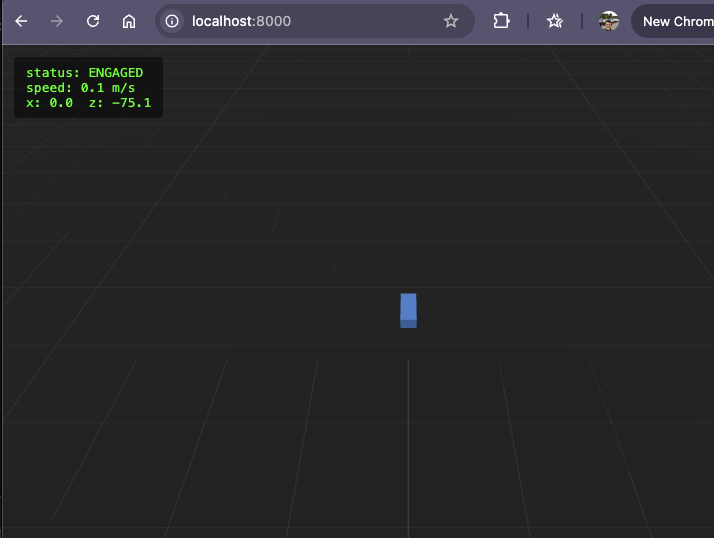

# AV Sim

Drives a simulated vehicle from waypoint A to waypoint B using the real openpilot driving stack
(perception, planning, control), with a lightweight browser view fed by openpilot's own
telemetry.

## Architecture

```
 ┌─────────────────────┐     camera frames / CAN      ┌───────────────────────┐
 │  MetaDrive (via     │ <───────────────────────────>│ openpilot             │
 │  waypoint_bridge.py)│                              │ (launch_openpilot.sh) │
 └─────────┬───────────┘                              └───────────┬───────────┘
           │ vehicle position/state (python, in-process)          │ cereal pub/sub
           │                                                      │ (liveLocationKalman,
           │                                                      │  selfdriveState)
           │                                          ┌───────────▼───────────┐
           │                                          │  telemetry_server.py  │
           │                                          │  (cereal subscriber,  │
           │                                          │   WebSocket server)   │
           │                                          └───────────┬───────────┘
           │                                                      │ JSON over WebSocket
           │                                          ┌───────────▼───────────┐
           └─ (rendered to MetaDrive's own camera,    │  viewer/ (three.js,   │
              consumed by openpilot's perception,     │  browser)             │
              not shown to the user)                  └───────────────────────┘
```

Three pieces, three different architectural styles deliberately, matching the course's own
framing:
1. **openpilot + waypoint_bridge.py** — the real driving stack (robotic control / pipeline
   style), running against MetaDrive instead of a real car.
2. **telemetry_server.py** — a cereal (pub/sub messaging) subscriber that republishes state as a
   WebSocket feed. This is the "pipeline feeding a presentation tier" seam, and the main course
   artifact worth drawing architectural attention to: it's a second, independent consumer of
   openpilot's own message bus, exactly the way openpilot's own UI, `cabana`, and `plotjuggler`
   are — nothing here reaches into openpilot internals.
3. **viewer/** — a static, build-free three.js page, N-tier client of the telemetry server.

## What "waypoint A to B" means today

**Not yet: two specific user-chosen coordinates.** `waypoint_bridge.py` re-enables MetaDrive's
own standard point-to-point task (a randomly generated road network with a real start point, a
real destination, and real arrival detection — `arrive_dest_done: True`) instead of openpilot's
stock `tools/sim` demo, which deliberately loops a fixed closed-loop track forever because it's
built for continuous lane-keeping regression tests, not a one-shot drive.

Routing to two arbitrary coordinates the user picks needs MetaDrive's navigation/route API, which
hasn't been verified against actual MetaDrive source yet (`metadrive` is a pip dependency of
openpilot, not vendored in this repo) — tracked as an open item below, not guessed at.

## Rendering: why three.js, not Unreal

Checked directly against openpilot's own source (`openpilot/tools/sim`, commit `a742df6`):
openpilot's simulator bridge only targets **MetaDrive** (Panda3D-based). There's no Unreal
integration to inherit. Per the project's decided direction, this viewer re-renders the sim's
telemetry in-browser with three.js rather than chasing Unreal-grade visuals — see the root
`README.md`'s Open Questions for the alternatives considered (CARLA/Unreal, custom renderer) and
why this one was picked first.

## Setup

This follows openpilot's own documented setup (`av-sim/openpilot/tools/README.md`), developed and
tested by comma.ai on Ubuntu 24.04; "most of openpilot should work natively on macOS" per their
own docs. **Confirmed 2026-10-09 on Owen's Mac: `tools/op.sh setup` + `scons -u` complete
successfully** (a couple of linker warnings about a jotpluggler, an unrelated dev tool that also
gets built by `scons -u`, and about a Linux-only mesa path — both harmless, build still reports
"done building targets").

```bash
git submodule update --init --recursive   # pulls openpilot + its own submodules (panda, opendbc, etc.)
cd av-sim/openpilot
tools/op.sh setup                         # openpilot's own managed dependency setup
source .venv/bin/activate
scons -u                                  # builds cereal's capnp bindings and native code
cd ../..
uv pip install --python av-sim/openpilot/.venv/bin/python -r av-sim/bridge/requirements.txt
uv pip install --python av-sim/openpilot/.venv/bin/python "metadrive-simulator @ git+https://github.com/commaai/metadrive.git@minimal"
```

**That last line is required and not part of openpilot's own documented setup.** Checked
directly: at the commit we pinned (`a742df6`), openpilot's own `pyproject.toml` has
`metadrive-simulator` commented out in its `tools` optional-dependency group, with their own note
"this can be added back once it's stripped down some more" — so `tools/op.sh setup` never
installs it, on any platform, regardless of extras selected. The code that uses it
(`metadrive_bridge.py`, our `waypoint_bridge.py`) is all still there and works once the package is
installed manually — confirmed 2026-10-09 on Owen's Mac, including the asset download MetaDrive
does on first run (`assets.zip` from comma's own GitHub releases).

**Use `uv pip install --python <path>`, not plain `pip install` and not bare `uv pip install`.**
Two real issues found running this on Owen's Mac (2026-10-09), both avoided by targeting the venv
by explicit path instead of relying on shell activation state:

- openpilot's `tools/op.sh setup` creates `.venv` via `uv`, and `uv`-managed venvs don't ship a
  `pip`/`pip3` binary *or* the `pip` Python module by design (confirmed: both `pip install` and
  `python -m pip install` fail there, even with the venv correctly activated) — so it has to be
  `uv pip install`, not plain `pip`.
- Relying on `$VIRTUAL_ENV` being active is fragile in practice: a stray top-level `.venv` (in
  Owen's case, auto-created by VS Code's Python extension opening the folder) can shadow which
  venv a bare `pip`/`python` command actually resolves to, especially across different terminal
  tabs. `--python openpilot/.venv/bin/python` sidesteps all of that by naming the exact
  interpreter directly, regardless of what's "active" in whatever shell you're in.

If VS Code (or anything else) creates a `.venv` at the repo root, it's not needed — remove it to
avoid the same confusion; the one venv that matters is `av-sim/openpilot/.venv`.

## Running

Four **long-running, concurrent** processes — each needs its own terminal tab, not run
sequentially in one. Tabs 1–3 need openpilot's venv actually activated: unlike the pip install
above, `launch_openpilot.sh` internally calls bare `python3`, so there's no dodging shell
activation state for it the same way. All paths below are relative to the `cmu-swarch` repo root.

Note the path in tab 1: `av-sim/openpilot/` is this repo's submodule directory; the
`openpilot/tools/sim/` underneath it is a second, nested `openpilot/` — the monorepo's own
internal package layout (confirmed 2026-10-09 after Owen hit `no such file or directory` on the
un-nested path).

```bash
# tab 1 — openpilot itself
source av-sim/openpilot/.venv/bin/activate
BLOCK=ui,soundd LOG_ROOT="$PWD/av-sim/logs" av-sim/openpilot/openpilot/tools/sim/launch_openpilot.sh
```

- **`LOG_ROOT`** keeps driving/boot logs inside the project instead of `~/.comma` (a real,
  supported env var — `common/hardware/hw.py`'s `Paths.comma_home()`). Smaller config/state
  (`Params`, under `comma_home()/persist`) deliberately stays in `~/.comma`: it's shared across
  all three openpilot-facing tabs (e.g. the bridge sets `AlphaLongitudinalEnabled`, which
  `controlsd`/`plannerd` need to read), and relocating it needs every tab's environment to match
  exactly or that sharing silently breaks.
- **`BLOCK=ui,soundd`** — confirmed 2026-10-09, both are openpilot's own native on-device UI
  components, not something we use (we built our own browser viewer instead): `ui`
  (`PythonProcess("ui", ..., always_run)`) tries to use D-Bus for its WiFi settings screen, which
  doesn't exist on macOS, so it crash-loops with a `FileNotFoundError`; it also opens a
  non-resizable, fixed-size raylib window sized for comma's own touchscreen hardware, not a
  desktop. `soundd` plays real alert audio (`selfdrive/ui/soundd.py`, up to full volume) through
  your actual speakers — also built for real-car alerts, not needed here. Blocking both is
  harmless to `controlsd`/`plannerd`/`locationd`, the daemons that actually matter for this sim.

```bash
# tab 2 — the waypoint bridge (drives MetaDrive, feeds openpilot camera/CAN)
source av-sim/openpilot/.venv/bin/activate
python3 av-sim/bridge/run_waypoint_bridge.py
```

```bash
# tab 3 — the telemetry relay for the browser
source av-sim/openpilot/.venv/bin/activate
python3 av-sim/bridge/telemetry_server.py
```

```bash
# tab 4 — serve the browser viewer
python3 -m http.server --directory av-sim/viewer
```

Then open the viewer in a browser (the URL `http.server` prints, e.g. `http://localhost:8000`) —
it connects to `ws://localhost:8765`. Opening `av-sim/viewer/index.html` as a plain `file://` URL
also works and skips tab 4 entirely, if you don't need it served.



Confirmed working end-to-end 2026-10-09: `status: ENGAGED`, live `speed`/`x`/`z` updating as the
car drives, exactly like the screenshot above.

### Driving the car (tab 2's terminal, not the browser)

**Controls go into tab 2's terminal window specifically — click into it and type there.**
Confirmed 2026-10-09: `run_waypoint_bridge.py` reads raw keystrokes directly off that terminal's
stdin (`openpilot/tools/sim/lib/keyboard_ctrl.py`, via `termios`), so the keyboard help table it
prints on startup is not decorative — the browser tab has no way to send input at all.

| key    | functionality                |
|--------|-------------------------------|
| `2`,`1`| **Engage**: Cruise Set, then Cruise Resume/Accel |
| `3`    | Cruise Cancel (disengage)     |
| `w a s d` | Manual throttle/steer/brake (works whether engaged or not) |
| `i`    | Toggle ignition               |
| `r`    | Reset simulation              |
| `q`    | Exit                           |

Quick sanity check if nothing seems to respond: press `w` first — if speed/x/z start moving in
the browser, input is reaching the bridge fine and it's just a matter of engaging (`2` then `1`).
If `w` does nothing either, that's a focus/input problem, not an engagement one.

## Open items

- **Arbitrary waypoint coordinates.** Current state generates a random start/destination via
  MetaDrive's `BIG_BLOCK_NUM` map type. Real "type in A and B" needs MetaDrive's route/navigation
  API — next step is reading `metadrive`'s own source (it's not vendored here) to find the right
  hook, likely in its navigation module rather than `map_config`.
- **End-to-end run in progress on Owen's Mac (2026-10-09), real bugs found and fixed along the
  way:** `tools/op.sh setup` + `scons -u` succeed; openpilot's own `ui`/`soundd` processes
  blocked (harmless, built for real-car hardware, see Running); `metadrive-simulator` needed
  installing manually (commented out upstream, see Setup); a `start_seed=None` bug in our own
  `waypoint_bridge.py` crashed MetaDrive's map manager, fixed (fell back to MetaDrive's own
  default of `0`); `telemetry_server.py` subscribed to `liveLocationKalman`, which turned out to
  be deprecated at this commit (confirmed via a real `KeyError` in `cereal.services.SERVICE_LIST`)
  — switched to `gpsLocationExternal`, the raw GPS topic our own sim actually publishes, which
  turned out simpler anyway (lat/lon/alt/speed/bearing all in one topic, no Kalman-filter warm-up
  needed). MetaDrive spawns, downloads its assets, builds a world, and the browser viewer loads.
  Not yet confirmed: openpilot actually engaging and driving the car, and live telemetry actually
  reaching the browser (viewer loading successfully isn't the same as it receiving real data).
- **Dual simulator consumers.** `waypoint_bridge.py`'s in-process vehicle state (consumed by
  MetaDrive/openpilot directly) and `telemetry_server.py`'s cereal-bus state (consumed by the
  browser) are two separate paths by design — worth drawing out explicitly as a course artifact
  on "same data, two different architectural seams."
